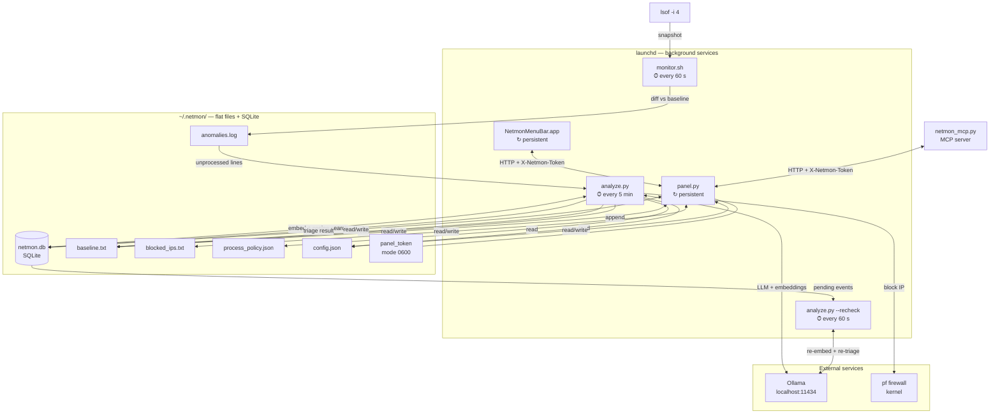
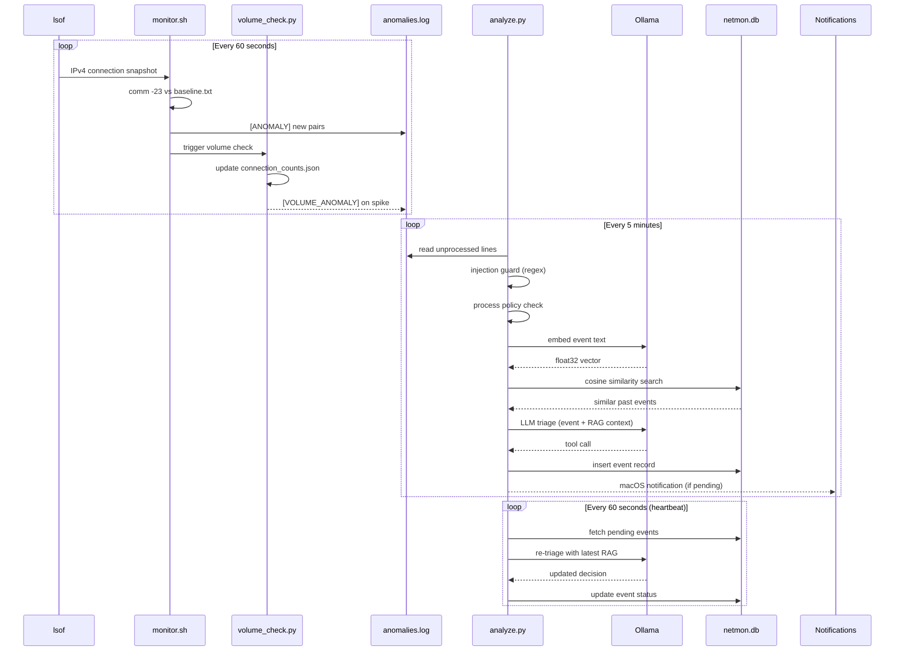
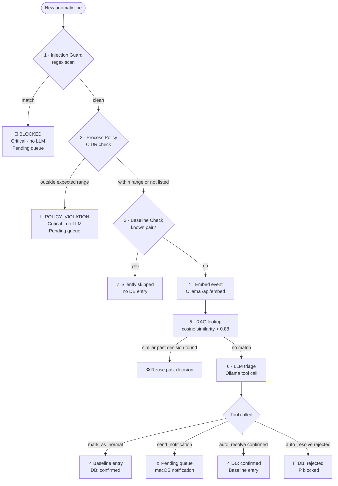

# Architecture

## System components

---

## Detection data flow

---

## Decision pipeline

Every event from `anomalies.log` passes through six layers in strict order. Earlier layers are cheaper and can skip the rest.

---

## Security model

- **Loopback-only** — panel binds to `127.0.0.1:6543`; no LAN exposure
- **Token auth** — all panel routes require `X-Netmon-Token` (timing-safe `secrets.compare_digest`)
- **No cloud by default** — all inference local via Ollama; cloud backend is explicit opt-in
- **AI agent protection** — process policy + injection guard target exfiltration and prompt injection specifically
- **Kernel enforcement** — optional pf anchor blocks rejected IPs at the network layer

## Alert severity matrix

| Tag | Severity | Routed via | LLM involved? |
|-----|----------|-----------|---------------|
| `[BLOCKED]` | Critical | Direct DB insert | No |
| `[POLICY_VIOLATION]` | Critical | Direct DB insert + notify | No |
| `[VOLUME_ANOMALY]` | Warning+ | LLM triage | Yes |
| `[ANOMALY]` | Info–Critical | LLM triage | Yes |
