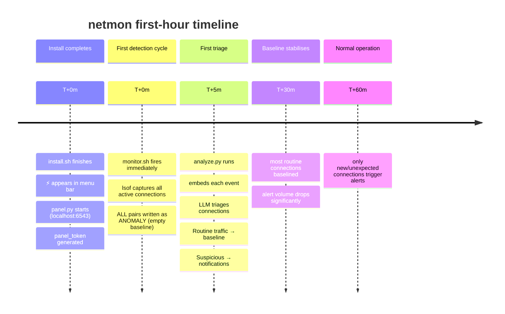
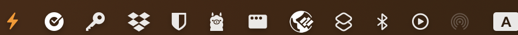

# First Run

## What happens in the first hour



!!! note "Baseline starts empty — not pre-seeded"
    On first run, `baseline.txt` is empty. Every active connection is written as `[ANOMALY]`. This is intentional — `analyze.py` then classifies them. Most are immediately marked as normal by the LLM and added to baseline.

---

## The initial burst

Expect 20–100 events on the first analyze run. Every browser tab, background daemon, and cloud-sync service that was connected at install time appears as a new anomaly.

**Recommended first-run workflow:**

1. **Enable Autonomous mode** immediately after install — let the LLM process the initial burst without interrupting you
2. **Wait 15–30 minutes** for the baseline to stabilise
3. **Check the Baseline tab** — it should now contain 100–300 entries covering your routine traffic
4. **Switch back to Review mode** for ongoing oversight

---

## The panel


| Element | What it means |
|---------|--------------|
| `⚡ netmon` | App name |
| **N pending** badge | Events waiting for your decision |
| **Last run** | When `analyze.py` last completed a triage cycle |
| **Auto / Review** button | Current mode — click to toggle |
| **↺ Refresh** | Manually re-fetch events |

---

## Menu bar icon



The lightning bolt `⚡` is always visible in the top-right menu bar. It turns orange/bright when pending events exist.

---

## First access

The panel is inside the native Swift app — click `⚡` to open it. For API access, authenticate with your token:

```bash
TOKEN=$(cat ~/.netmon/panel_token)
curl -H "Host: localhost:6543" -H "X-Netmon-Token: $TOKEN" \
     http://localhost:6543/api/events | python3 -m json.tool
```

---

## Next steps

- [Panel UI](user-guide/panel.md) — complete walkthrough of all four tabs
- [Review vs Autonomous](user-guide/modes.md) — when to use each
- [Configuration](configuration/config.md) — tune models and thresholds
