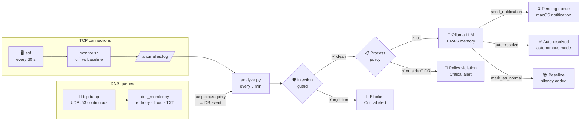

## How it works



---

## Key features

<div class="grid cards" markdown>

-   :material-shield-check:{ .lg .middle } **Multi-layer detection**

    ---

    Injection guard · process policy · DNS exfiltration · volume anomaly · LLM triage · IP blocking — seven independent layers that never all fail at once.

    [:octicons-arrow-right-24: Security overview](security/index.md)

-   :material-brain:{ .lg .middle } **AI-assisted triage**

    ---

    A tool-calling local LLM (Ollama) classifies each new connection with context from a RAG store of past decisions. No repeat prompting.

    [:octicons-arrow-right-24: Models](configuration/models.md)

-   :material-lock:{ .lg .middle } **Private by default**

    ---

    Everything runs on-device with Ollama. No data leaves your Mac unless you explicitly opt into the Claude API backend.

    [:octicons-arrow-right-24: Configuration](configuration/config.md)

-   :material-eye:{ .lg .middle } **Review & Autonomous modes**

    ---

    Choose human-in-the-loop (Review) or fully automated (Autonomous). Switch any time from the menu bar or panel.

    [:octicons-arrow-right-24: Modes](user-guide/modes.md)

-   :material-robot-confused:{ .lg .middle } **AI agent protection**

    ---

    Process policy enforcement catches prompt injection exfiltration from Claude Code, Cursor, Copilot — before the LLM is consulted.

    [:octicons-arrow-right-24: Process Policy](configuration/process-policy.md)

-   :material-api:{ .lg .middle } **MCP integration**

    ---

    Query and act on events from Claude Code or Claude Desktop via a local MCP server — no browser required.

    [:octicons-arrow-right-24: MCP](mcp.md)

</div>

---

## Quick start

=== "Install"

    ```bash
    git clone https://github.com/Algiras/netmon ~/.netmon
    bash ~/.netmon/install.sh
    ```

=== "Requirements"

    | Requirement | Install |
    |-------------|---------|
    | macOS 13+ | — |
    | [Ollama](https://ollama.com) | `brew install ollama` |
    | Python 3.10+ | `brew install python` |
    | Xcode CLT | `xcode-select --install` |

=== "After install"

    ```
    ⚡  appears in your menu bar
    http://localhost:6543  panel API
    ~/.netmon/panel_token  auth token
    ```

[Get started :octicons-arrow-right-24:](getting-started.md){ .md-button .md-button--primary }
[API reference :octicons-arrow-right-24:](api-reference.md){ .md-button }
