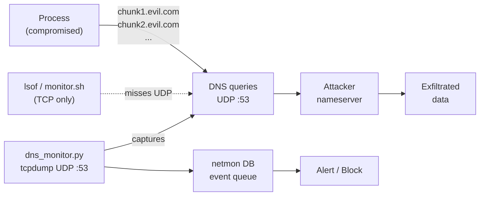

# DNS Exfiltration Detection

DNS exfiltration bypasses TCP-layer monitoring because DNS uses UDP and resolves through the OS resolver (`mDNSResponder`), not directly through the process's network socket. A compromised process — or an AI coding agent acting under prompt injection — can silently leak data by encoding it in DNS query names sent to an attacker-controlled nameserver.



---

## How it works

`dns_monitor.py` runs as a KeepAlive LaunchAgent. It calls `sudo tcpdump -l -n udp port 53`, which captures all DNS traffic on the machine, and analyzes each query name in real time.

Detected events are written to the netmon DB with severity `high` and the prefix `[DNS]`. The existing analyze/notification pipeline picks them up within 5 minutes and sends a macOS notification or auto-resolves depending on operating mode.

---

## Detection heuristics

Four independent signals are checked on every DNS query:

### 1. Long subdomain label

| Threshold | Default |
|-----------|---------|
| `LABEL_LEN_LIMIT` | 45 chars |

A single DNS label cannot exceed 63 chars per RFC 1035. A label of 45+ chars is almost never a legitimate hostname — it is almost always data (binary, base64, or hex) being tunnelled out.

**Example:** `dGhpcyBpcyBhIHRlc3Q.attacker.com` → 22 chars of base64

### 2. High-entropy subdomain label

| Threshold | Default |
|-----------|---------|
| `ENTROPY_THRESHOLD` | 3.5 bits/char |
| `MIN_LABEL_LEN` | 20 chars (below this, check is skipped) |

Shannon entropy measures how "random" the characters look. Base32-encoded data scores ~3.32, base64 scores ~4.0. Legitimate hostnames are usually short dictionary words or version strings with entropy < 3.0.

| Label | Entropy | Flag? |
|-------|---------|-------|
| `api` | 1.58 | No |
| `d1234567890` | 2.85 | No |
| `jf3k2ma9bc4xz7wpqr` | 3.71 | **Yes** |
| `aB3kP9xQ2mR7tY5wZ1nV` | 4.39 | **Yes** |

### 3. TXT record query flood

| Threshold | Default |
|-----------|---------|
| `TXT_FLOOD_COUNT` | 5 queries in `WINDOW_SECS` |
| `WINDOW_SECS` | 60 seconds |

TXT records can carry arbitrary byte strings and are a popular C2 channel — the agent queries `cmd.evil.com TXT` and the server returns a command. Single TXT queries (DKIM, SPF lookups) are normal. Five or more TXT queries to the same parent domain within 60 seconds is anomalous.

### 4. Unique-subdomain flood

| Threshold | Default |
|-----------|---------|
| `SUBDOMAIN_FLOOD_COUNT` | 20 unique subdomains in `WINDOW_SECS` |
| `WINDOW_SECS` | 60 seconds |

The classic DNS tunnel pattern: encode data across many unique subdomain labels — `chunk1.tunnel.evil.com`, `chunk2.tunnel.evil.com`, … — so each query looks like a normal A record lookup. 20 distinct subdomains under one parent in 60 seconds is the trigger.

---

## Process attribution

macOS pcap (and therefore tcpdump) does not include the source process in packet metadata. When a suspicious query is detected, `dns_monitor.py` runs `lsof -i UDP:53` at that moment to list processes with open UDP:53 connections. This is best-effort — the suspicious process may no longer appear in `lsof` by the time the check runs, and multiple processes may be listed.

The `process` field in the DB event will contain the lsof result (e.g., `"curl, python3"`) or `"unknown"`.

---

## Known limitations

| Limitation | Impact |
|------------|--------|
| No process attribution from pcap | Event lists candidate processes, not a definitive one |
| No packet capture on loopback | Localhost DNS queries (rare) are not seen |
| Requires sudoers entry for tcpdump | If `/etc/sudoers.d/netmon` is missing, the daemon exits immediately |
| Entropy heuristic can false-positive on CDN hashes | e.g. some CloudFront URLs — adjust `ENTROPY_THRESHOLD` upward if noisy |
| Does not decode tunnel content | Only flags the pattern, not the actual exfiltrated bytes |

---

## Configuration

All thresholds are module-level constants in `dns_monitor.py`:

```python
ENTROPY_THRESHOLD     = 3.5   # bits/char
MIN_LABEL_LEN         = 20    # min label length to check entropy
LABEL_LEN_LIMIT       = 45    # long-label trigger
TXT_FLOOD_COUNT       = 5     # TXT queries per window
SUBDOMAIN_FLOOD_COUNT = 20    # unique subdomains per window
WINDOW_SECS           = 60    # rolling window (seconds)
```

Raise `ENTROPY_THRESHOLD` to 3.8 or 4.0 if you see false positives from CDN or analytics subdomains. Raise `SUBDOMAIN_FLOOD_COUNT` if a legitimate service generates many unique subdomains (e.g., some telemetry systems).

---

## Sudoers requirement

`dns_monitor.py` calls `sudo /usr/sbin/tcpdump`. The `/etc/sudoers.d/netmon` file written by `install.sh` grants passwordless access to exactly these commands (no more):

```
algimantask ALL=(root) NOPASSWD: /sbin/pfctl -t netmon_blocked -T add *
algimantask ALL=(root) NOPASSWD: /sbin/pfctl -t netmon_blocked -T delete *
algimantask ALL=(root) NOPASSWD: /sbin/pfctl -t netmon_blocked -T show
algimantask ALL=(root) NOPASSWD: /sbin/pfctl -a netmon -s rules
algimantask ALL=(root) NOPASSWD: /sbin/pfctl -s tables
algimantask ALL=(root) NOPASSWD: /usr/sbin/tcpdump -l -n udp port 53
```

If this file is absent, verify.sh will flag it and the DNS monitor will fail to start (error in `~/.netmon/dns.err`).

---

## Verification

```bash
~/.netmon/verify.sh   # includes sudoers and dns_monitor checks

# Simulate a high-entropy flood (safe — queries go to local resolver)
python3 -c "
import socket, random, string
parent = 'test.local'
for _ in range(25):
    label = ''.join(random.choices(string.ascii_lowercase + string.digits, k=22))
    try: socket.getaddrinfo(f'{label}.{parent}', None)
    except: pass
print('done — check ~/.netmon/dns.err or panel events')
"
```
