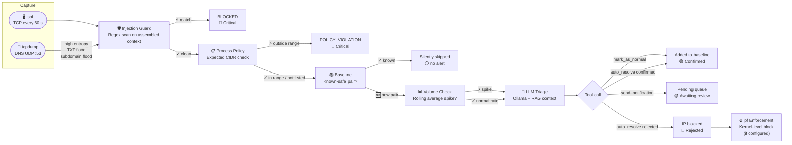

# Security Features Overview

netmon layers seven independent detection mechanisms. No single failure can let unexpected traffic go unnoticed.

## Defence pipeline

---

## Layer summary

-   :material-shield-bug:{ .lg .middle } **Injection Guard**

    ---

    Regex scan on the assembled triage context before the LLM sees it. Catches attempts to hijack the AI triage pipeline via crafted hostnames or process environments.

    No LLM involved — instant block.

    [:octicons-arrow-right-24: Details](injection-guard.md)

-   :material-clipboard-check:{ .lg .middle } **Process Policy**

    ---

    Per-process expected CIDR ranges. An AI agent connecting outside its declared endpoints triggers a Critical alert immediately — bypassing the LLM entirely.

    No LLM involved — instant Critical.

    [:octicons-arrow-right-24: Details](../configuration/process-policy.md)

-   :material-book-check:{ .lg .middle } **Baseline**

    ---

    Known-safe `process|IP:port` pairs are silently skipped. The LLM and embedding step are never called for baselined traffic.

    [:octicons-arrow-right-24: Details](baseline.md)

-   :material-chart-line:{ .lg .middle } **Volume Anomaly**

    ---

    Rolling connection-count baseline per pair. A spike beyond 3× the average triggers an alert even for fully baselined connections.

    [:octicons-arrow-right-24: Details](volume-anomaly.md)

-   :material-brain:{ .lg .middle } **LLM Triage**

    ---

    Tool-calling local LLM with RAG context. Past decisions retrieved by cosine similarity (threshold 0.88) — no repeat prompting for already-seen patterns.

    [:octicons-arrow-right-24: Architecture](../architecture.md)

-   :material-fire:{ .lg .middle } **IP Blocking & pf**

    ---

    Rejected events block the IP in `blocked_ips.txt`. With pf enforcement, blocks are applied at the macOS kernel level — no process can reach the IP.

    [:octicons-arrow-right-24: Details](ip-blocking.md)

-   :material-dns:{ .lg .middle } **DNS Exfiltration Detection**

    ---

    `dns_monitor.py` captures all DNS queries via tcpdump and flags high-entropy labels, long subdomains, TXT floods, and unique-subdomain floods — the four fingerprints of DNS tunnelling.

    [:octicons-arrow-right-24: Details](dns-exfil.md)

---

## Threat model

=== "Addressed"

    | Threat | Layer |
    |--------|-------|
    | Unexpected connections from any process | Baseline + LLM triage |
    | AI agent exfiltration via prompt injection | Process policy (proactive) |
    | LLM triage hijacking via crafted content | Injection guard |
    | Volume-based data exfiltration from known processes | Volume anomaly |
    | Persistent access from known-bad IPs | IP blocking + pf |
    | Supply-chain or malware C2 beaconing | Baseline + LLM triage |
    | DNS tunnelling / DNS exfiltration | DNS exfiltration detection |
    | C2 channels over TXT records | DNS exfiltration detection |

=== "Not addressed"

    | Out of scope | Why |
    |-------------|-----|
    | Encrypted payload inspection | lsof sees connections, not payloads |
    | Inbound connections | Only outbound TCP/UDP via `lsof -i 4` |
    | Lateral LAN movement | Loopback-scoped detection only |
    | Kernel rootkits hiding from lsof | Below the detection boundary |
    | DoH (DNS-over-HTTPS) tunnelling | Encrypted; indistinguishable from HTTPS traffic |
