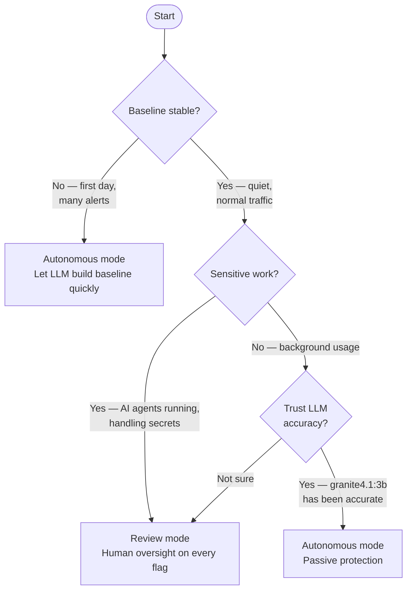

# Review vs Autonomous Mode

netmon has two operating modes that control how events are resolved.

## How each mode works

=== "Review mode (default)"

    ```mermaid
    sequenceDiagram
        participant analyze.py
        participant LLM
        participant Notifications
        participant You
        participant DB

        analyze.py->>LLM: event + RAG context
        Note over LLM: available tools:<br/>send_notification<br/>mark_as_normal
        LLM-->>analyze.py: send_notification("suspicious traffic")
        analyze.py->>DB: insert pending event
        analyze.py->>Notifications: macOS alert
        Notifications->>You: "node → 198.51.100.7:443"
        You->>analyze.py: Confirm / Reject
        analyze.py->>DB: update status
    ```

=== "Autonomous mode"

    ```mermaid
    sequenceDiagram
        participant analyze.py
        participant LLM
        participant DB
        participant pf

        analyze.py->>LLM: event + RAG context
        Note over LLM: available tools:<br/>auto_resolve<br/>mark_as_normal
        alt benign traffic
            LLM-->>analyze.py: auto_resolve(decision="confirmed")
            analyze.py->>DB: confirmed + baseline entry
        else suspicious traffic
            LLM-->>analyze.py: auto_resolve(decision="rejected")
            analyze.py->>DB: rejected
            analyze.py->>pf: block IP (if enforcement active)
        end
    ```

---

## Tool availability by mode

| Tool | Review | Autonomous | Effect |
|------|--------|------------|--------|
| `send_notification` | ✅ | ❌ | Creates pending event + macOS alert |
| `auto_resolve` | ❌ | ✅ | Direct confirm or reject, no human step |
| `mark_as_normal` | ✅ | ✅ | Silent baseline entry, no alert |

---

## Choosing a mode



---

## Switching modes

**From the panel** — click the **Auto** / **Review** button in the panel header.

**From the API:**

```bash
TOKEN=$(cat ~/.netmon/panel_token)

# Enable autonomous
curl -X POST http://localhost:6543/config \
  -H "Host: localhost:6543" -H "X-Netmon-Token: $TOKEN" \
  -H "Content-Type: application/json" \
  -d '{"autonomous": true}'

# Back to review
curl -X POST http://localhost:6543/config \
  -H "Host: localhost:6543" -H "X-Netmon-Token: $TOKEN" \
  -H "Content-Type: application/json" \
  -d '{"autonomous": false}'
```

Mode is persisted in `config.json` and survives restarts.

---

!!! warning "Autonomous mode bypasses human review"
    In Autonomous mode, suspicious connections are rejected and IPs blocked without your confirmation. A false positive can disrupt connectivity to a legitimate service. Start with Review mode and switch to Autonomous only after the baseline is stable.

!!! tip "Heartbeat catches LLM indecision"
    If the LLM is uncertain and doesn't call a tool, the event stays pending. The 60-second heartbeat re-evaluates all pending events with updated RAG context — most resolve within a few minutes.
