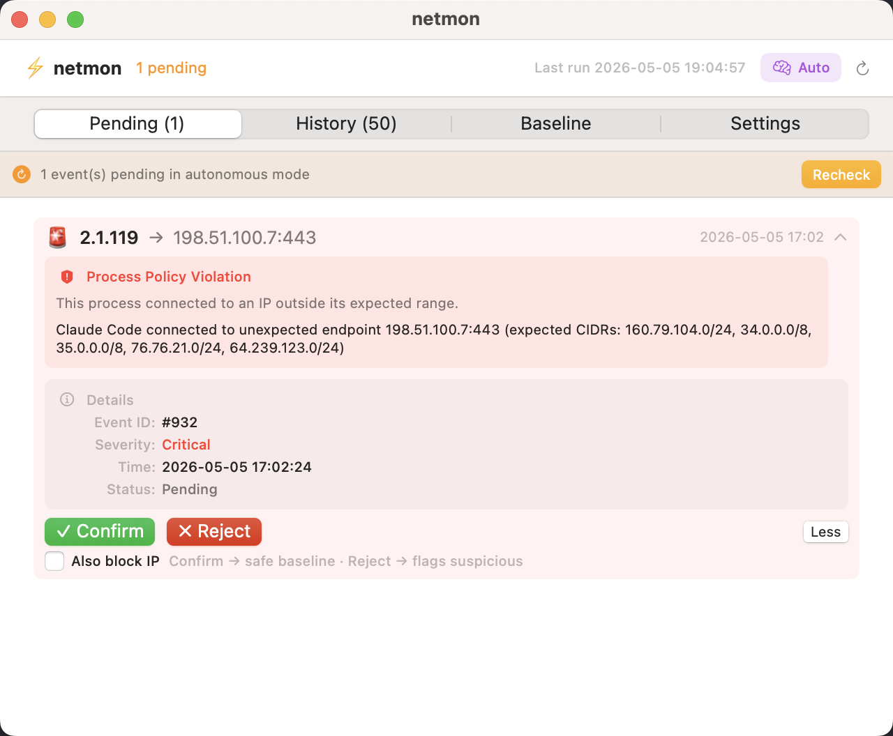
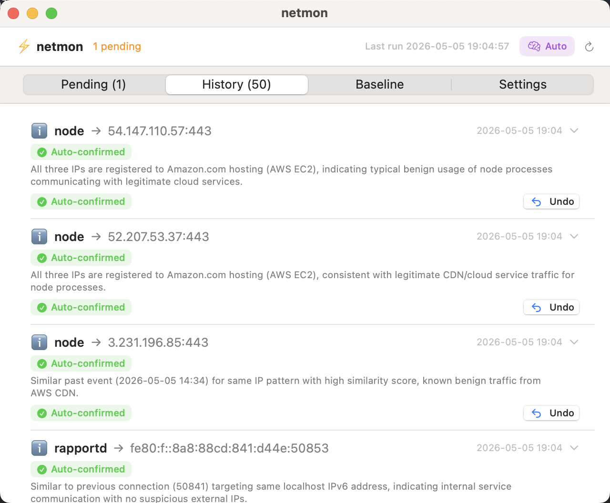
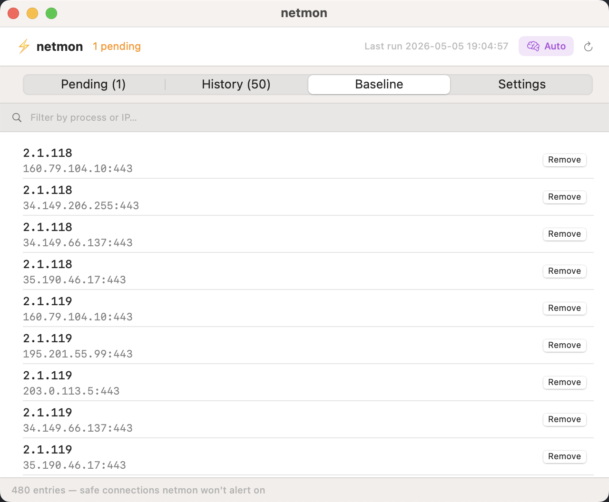
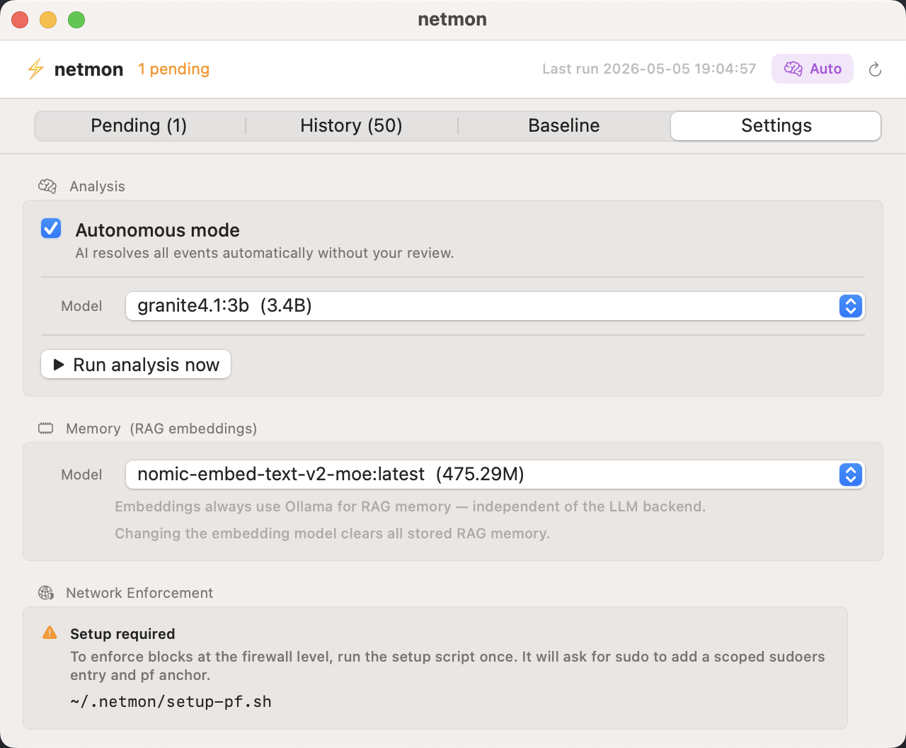

# Panel UI

The panel is a native macOS window embedded in the menu bar app. Open it by clicking `⚡` in the menu bar and selecting **Open Panel**, or by clicking the badge count when events are pending.

---

## Pending tab

The **Pending** tab shows events that need your attention. Each card contains:

| Element | Meaning |
|---------|---------|
| **Process name** | The macOS process that opened the connection |
| **→ IP:port** | Remote endpoint (IP + TCP/UDP port) |
| **Timestamp** | When the connection was first detected |
| **Severity badge** | `Critical`, `Warning`, or `Info` |
| **LLM summary** | Plain-English explanation of why the event was flagged |
| **Event ID / Status** | Internal DB identifier and current state |

### Alert types

| Badge colour | Type | What triggered it |
|-------------|------|------------------|
| Red — **Process Policy Violation** | The process connected outside its declared expected CIDRs | Process policy check (no LLM) |
| Orange — **Injection Attempt** | A connection payload pattern matched the injection guard | Injection guard (no LLM) |
| Yellow — **Volume Anomaly** | A baselined connection spiked beyond its rolling average | Volume check + LLM |
| Grey/blue — **Anomaly** | A new process×IP pair not in baseline | LLM triage |

### Actions

**Confirm** — marks the connection as safe and adds it to `baseline.txt`. Future connections from the same process to the same IP are silently ignored.

**Reject** — marks the connection as suspicious. The IP is flagged; with [pf enforcement](../security/ip-blocking.md) enabled, it is also blocked at the firewall level.

**Also block IP** (checkbox) — when ticked before Confirm/Reject, the remote IP is added to `blocked_ips.txt` regardless of the decision. Useful when you want to log a connection as "known bad" without letting it slip through again.

**Less / More** — toggles the details section (Event ID, Severity, Time, Status).

**Recheck** (top-right of the pending banner) — manually triggers `analyze.py --recheck` to re-evaluate all pending events using the latest RAG context.

---

## History tab

The **History** tab shows the last 50 resolved events. Each row shows:

- Process name and remote endpoint
- Resolution (auto-confirmed, confirmed, rejected, auto-resolved)
- LLM summary
- **Undo** button — reverts the last decision, removing the baseline entry or unblocking the IP

Use History to audit what the LLM decided and to correct mistakes.

---

## Baseline tab

The **Baseline** tab lists every process×IP pair in `baseline.txt` — connections netmon will never alert on again.

- **Filter bar** — type a process name or IP to narrow the list
- **Remove** button — deletes the entry from baseline, so the next occurrence will be evaluated again
- **Footer count** — total number of baseline entries

A typical healthy baseline contains 200–500 entries after the first day of use.

---

## Settings tab

### Analysis section

**Autonomous mode** checkbox — when checked, the LLM calls `auto_resolve` directly (no human review step). Safe for quiet periods; switch back to Review mode when you want oversight.

**Model** dropdown — select the Ollama LLM to use for triage. Only models that advertise `tools` capability are shown. The selection is saved to `config.json` immediately.

**Run analysis now** — manually triggers `analyze.py` outside the 5-minute schedule. Useful after a model change or when you want immediate triage.

### Memory (RAG embeddings)

**Model** dropdown — select the Ollama embedding model used to index past events. Only embedding-capable models are shown.

!!! warning "Changing the embedding model clears all stored RAG memory"
    Vectors computed with different models are incompatible. The panel asks for confirmation before switching. After switching, past events are re-embedded on the next analyze run.

### Network Enforcement

Shows whether the pf firewall anchor is configured. If not set up, a setup button appears. See [IP Blocking & pf](../security/ip-blocking.md) for details.
