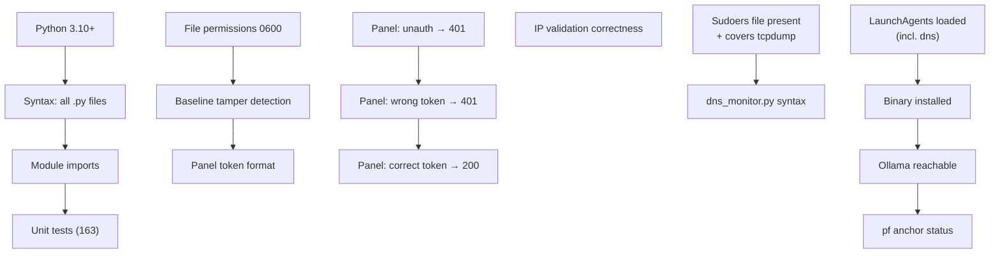

# Verification & Health Checks

Run `~/.netmon/verify.sh` after install or any configuration change. It performs 31 automated checks across runtime, security, and services, and exits non-zero if any fail.

```bash
~/.netmon/verify.sh
```

---

## What it checks



---

## Check groups

### Runtime

| Check | What it verifies |
|-------|-----------------|
| Python version | 3.10 or later |
| Syntax | All `~/.netmon/*.py` files compile without errors |
| Module imports | `db`, `embed`, `panel`, `analyze` all importable together |
| Unit tests | 139 tests pass in `tests/` |

### Security

| Check | What it verifies |
|-------|-----------------|
| File permissions | `config.json`, `panel_token`, `baseline.sha256` are mode 0600 |
| Baseline tamper | SHA256 of `baseline.txt` matches `baseline.sha256` |
| Token format | `panel_token` is exactly 64 lowercase hex characters |
| Unauthenticated request | Panel returns **401** without token |
| Wrong token | Panel returns **401** for `X-Netmon-Token: deadbeef` |
| Correct token | Panel returns **200** with valid `X-Netmon-Token` |
| IP validation | RFC1918 rejected; TEST-NET / public IPs allowed |

### DNS monitor

| Check | What it verifies |
|-------|-----------------|
| Sudoers file | `/etc/sudoers.d/netmon` exists with mode 440 |
| Sudoers covers tcpdump | Entry for `/usr/sbin/tcpdump -l -n udp port 53` present |
| dns_monitor.py syntax | File compiles without errors |

### Services

| Check | What it verifies |
|-------|-----------------|
| LaunchAgents | `com.user.netmon`, `.analyze`, `.heartbeat`, `.dns`, `.panel`, `.menubar`, `.watchdog` all loaded |
| Binary | `/Applications/NetmonMenuBar.app` executable present |
| Ollama | `localhost:11434` responds within 3 seconds |
| pf anchor | Reports whether `netmon_blocked` table is active |

---

## Interpreting failures

=== "Permission failures"

    ```bash
    chmod 0600 ~/.netmon/config.json
    chmod 0600 ~/.netmon/panel_token
    chmod 0600 ~/.netmon/baseline.sha256
    ```

=== "Baseline tamper"

    If the checksum doesn't match, the file may have been modified outside the panel.
    Open the panel → Baseline tab → any action will rewrite the checksum.
    If you didn't touch it, treat this as a security alert and audit the file.

=== "Sudoers / DNS monitor"

    If `/etc/sudoers.d/netmon` is missing, run `install.sh` or create it manually:

    ```bash
    PFCTL=/sbin/pfctl; TCPDUMP=/usr/sbin/tcpdump; USER=$(whoami)
    TMP=$(mktemp)
    cat > "$TMP" << EOF
    $USER ALL=(root) NOPASSWD: $PFCTL -t netmon_blocked -T add *
    $USER ALL=(root) NOPASSWD: $PFCTL -t netmon_blocked -T delete *
    $USER ALL=(root) NOPASSWD: $PFCTL -t netmon_blocked -T show
    $USER ALL=(root) NOPASSWD: $PFCTL -a netmon -s rules
    $USER ALL=(root) NOPASSWD: $PFCTL -s tables
    $USER ALL=(root) NOPASSWD: $TCPDUMP -l -n udp port 53
    EOF
    sudo visudo -c -f "$TMP" && sudo cp "$TMP" /etc/sudoers.d/netmon && sudo chmod 440 /etc/sudoers.d/netmon
    rm "$TMP"
    ```

    Then load the DNS monitor agent:
    ```bash
    launchctl bootstrap "gui/$(id -u)" ~/Library/LaunchAgents/com.user.netmon.dns.plist
    ```

=== "Panel not responding"

    ```bash
    launchctl list com.user.netmon.panel   # check status
    launchctl bootout gui/$(id -u) ~/Library/LaunchAgents/com.user.netmon.panel.plist
    launchctl bootstrap gui/$(id -u) ~/Library/LaunchAgents/com.user.netmon.panel.plist
    cat ~/.netmon/panel.log                # read logs
    ```

=== "LaunchAgent not loaded"

    ```bash
    # reload all agents
    for plist in ~/Library/LaunchAgents/com.user.netmon*.plist; do
        launchctl bootout gui/$(id -u) "$plist" 2>/dev/null || true
        launchctl bootstrap gui/$(id -u) "$plist"
    done
    ```

=== "Ollama not running"

    ```bash
    brew services start ollama
    # or:
    ollama serve &
    ```

=== "Unit test failures"

    ```bash
    cd ~/.netmon
    python3 -m pytest tests/ -v   # full output
    ```

---

## Running continuously

Add a cron entry (or LaunchAgent) to run verify.sh and pipe failures to a log:

```bash
# run every 6 hours; log failures only
0 */6 * * * bash ~/.netmon/verify.sh >> ~/.netmon/verify.log 2>&1 || \
  osascript -e 'display notification "verify.sh failed — check ~/.netmon/verify.log" with title "netmon"'
```

---

## Manual spot checks

### Confirm panel auth

```bash
TOKEN=$(cat ~/.netmon/panel_token)

# should return JSON
curl -s -H "Host: localhost:6543" -H "X-Netmon-Token: $TOKEN" \
     http://localhost:6543/api/config | python3 -m json.tool

# should return 401
curl -i -H "Host: localhost:6543" http://localhost:6543/api/config
```

### Confirm IP validation

```bash
python3 -c "
import sys; sys.path.insert(0,'$HOME/.netmon'); import analyze
try:
    print('PASS — 198.51.100.1 accepted:', analyze._validate_ip('198.51.100.1'))
except ValueError as e:
    print('FAIL:', e)
try:
    analyze._validate_ip('192.168.1.1')
    print('FAIL — 192.168.1.1 should be rejected')
except ValueError:
    print('PASS — 192.168.1.1 rejected')
"
```

### Confirm baseline integrity

```bash
shasum -a 256 ~/.netmon/baseline.txt | awk '{print $1}'
cat ~/.netmon/baseline.sha256
# both lines should match
```
